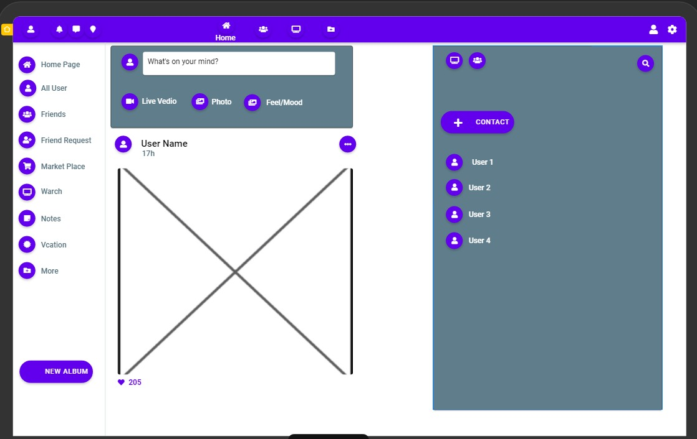
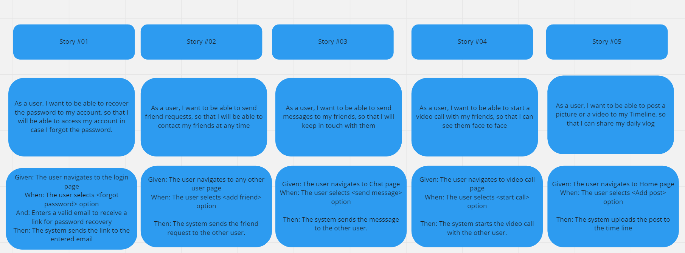
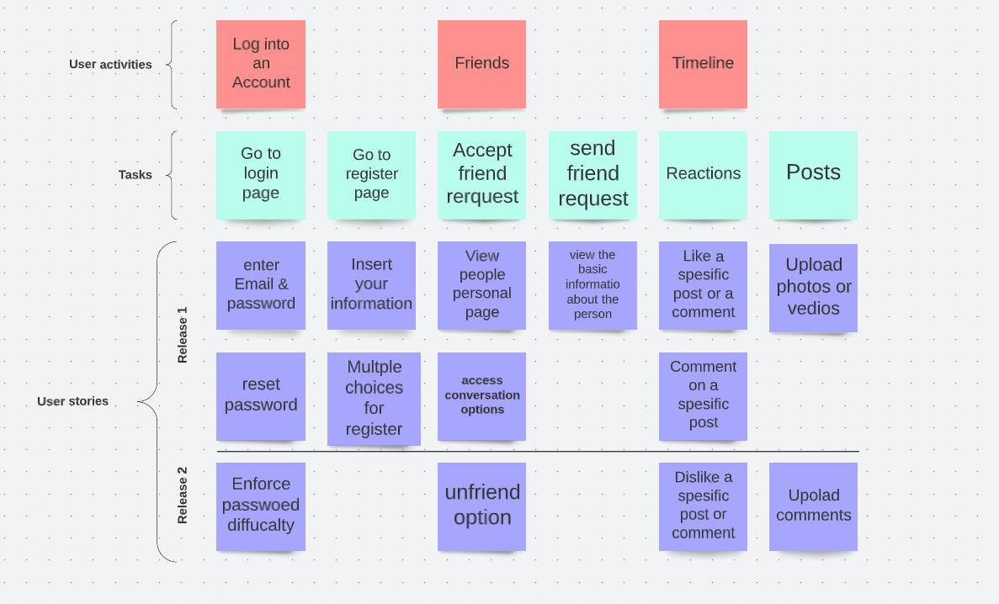
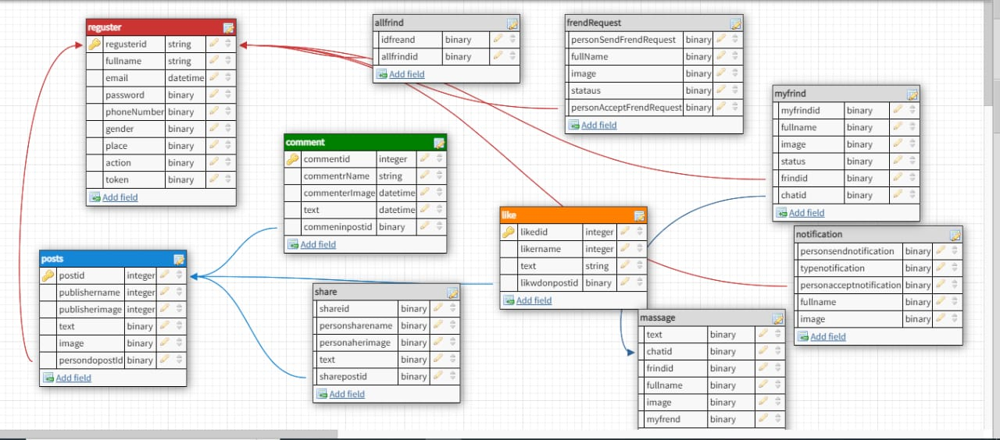

# Wireframes & Software Requirements

## Wireframe 

#### 

## User stories 

* #### Multiple user story scenarios have been implemented. 

#### 

* #### And user story mapping 

#### 

## Data modeling 

 * #### All in One is a social media platform that offers a lot of services and functions that you won't find in every social media platform available today.

* #### All in One is dedecated for people who is getting confused by the veraity of social media platforms, so what we offer is every single service in social media sites in one platform. 

* #### The platform's minimum features are the basics of any social media platform: 

1. #### Friend list .
2. #### Communication Portal (Chat or video call).
3. #### Timeline 

## Database Schema Diagram

#### 

## System requirements

### [System requirements - Click here](requirements.md).